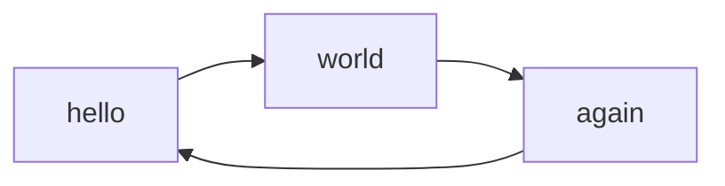

# Docs

## View the documentation locally:
Run: 
```sh
mkdocs serve
```
and go to `localhost:8000` to view the docs. Mkdocs hot-reloads the docs, so any changes you make will be immediately visible.


## Versioning 
We use `mike` to manage versioning for our documentation. It creates a snapshot of the documentation for each version of the project, allowing users to access the appropriate docs for the version they're using—even if it's an older one.

### Build new docs version 
Build the docs for the current project version: 
```sh 
mike deploy $(cz version --project)
```

Alias the new version of the docs to "latest" and set that as the default docs version.
```sh
mike alias $(cz version --project) latest
mike set-default latest
```

## Diagrams 
Mermaid diagrams can be written in a `mermaid` code block, and they will be rendered as diagrams: 



## Tooltips 

Tooltips and other such "admonitions" can be written with a `!!!` block:

!!! note
    This is a note.

!!! tip
    This is a tip.

!!! warning
    Be careful!

!!! danger
    This is dangerous!

## Code blocks 

```python 
def divide(a: float, b: float) -> float:
    """
    Return the division of two numbers. Raise an error if dividing by zero.

    Args:
        a (float): The numerator.
        b (float): The denominator.

    Returns:
        float: The result of the division.

    Raises:
        ValueError: If the denominator is zero.
    """
    if b == 0:
        raise ValueError("Cannot divide by zero.")
    return a / b
```